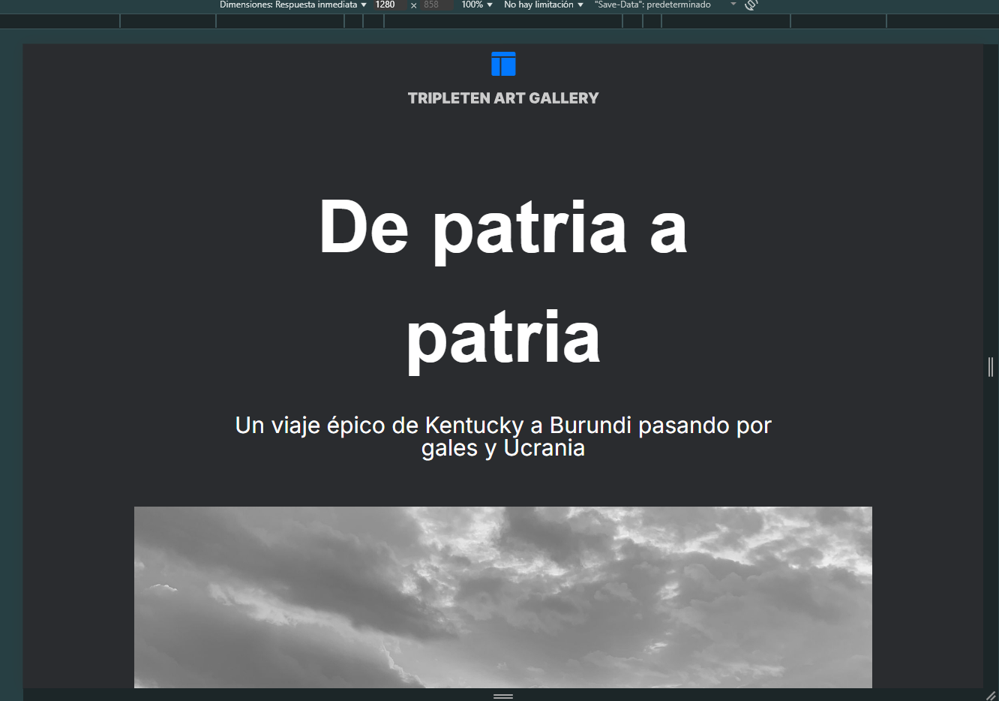
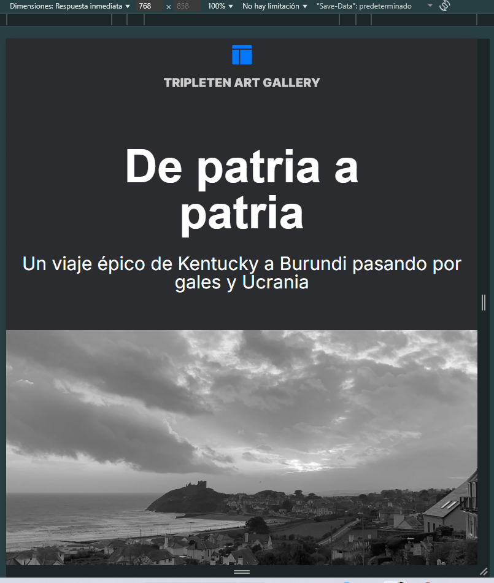
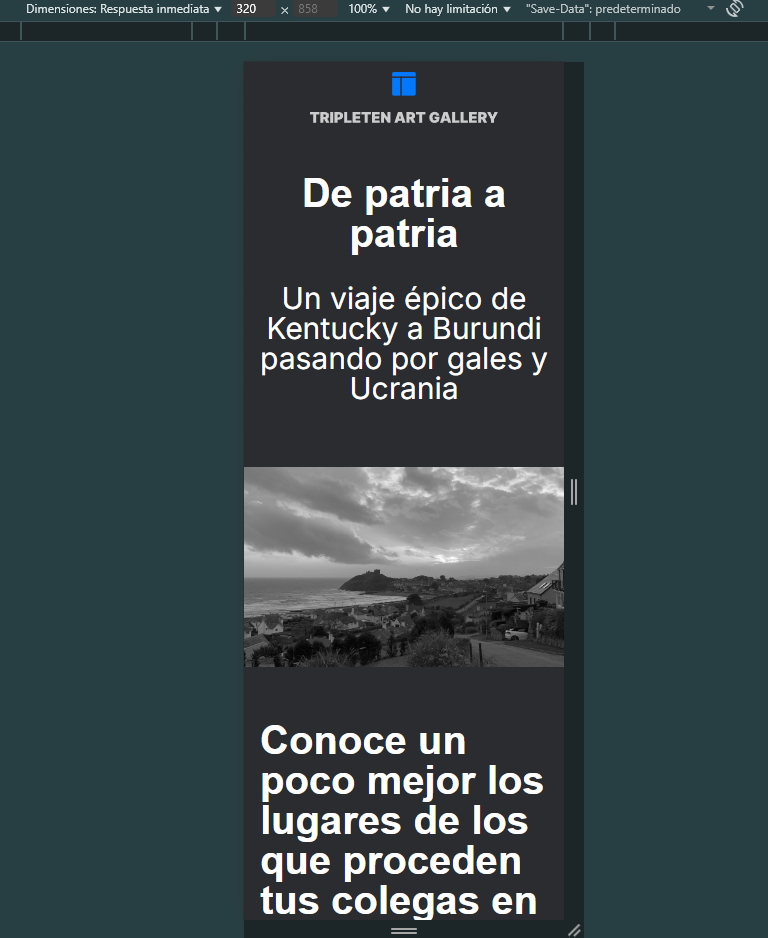

# Tripleten web_project_homeland

# Proyecto del Sprint 5 "Galeria de Arte (De patria a Patria)"

# Descripción del proyecto:

Es una galería de arte digital que presenta las ciudades natales de algunos empleados de TripleTen. Es como una exposición virtual que celebra la diversidad cultural y los orígenes de las personas que forman parte de la comunidad TripleTen.

## Descripción de tecnicas utilizadas:

- Crear un diseño completamente responsivo
- Implementar fuentes locales (Inter)
- Usar consultas de medios (media queries)
- Aplicar técnicas de diseño flexible
- Uso de object-fit para imágenes responsivas

  Para que el sitio pueda funcionar perfectamente en

* Desktop: 1280px
  
* Tablet: 768px
  
* Mobile: 320px
  

  # Descripción de la segunda parte del proyecto:

  Se muestran fotografias de lugares, donde nuestros colegas han vivido, también algunas historias de sus lugares natales.

  ## Descripción de las tecnicas utilizadas:

  - Grid Layout para las secciones de photo y places.
  - Media Queries Avanzadas para los puntos de ruptura en resoluciones intermedias.
  - Gradients degradados a botones.
  - Shadows para dar profundidad a las imagenes.
  - Efecto Hover Cuando se pasa el cursor en los botones.
  - Git brach El uso de ramas para cada nueva seccion.

https://bians-coder.github.io/web_project_homeland/
